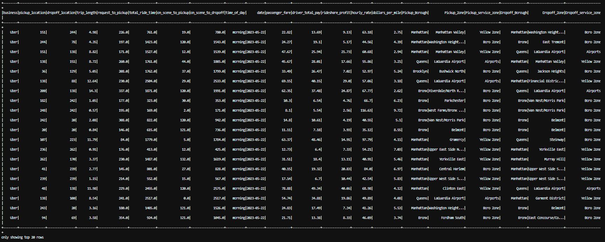
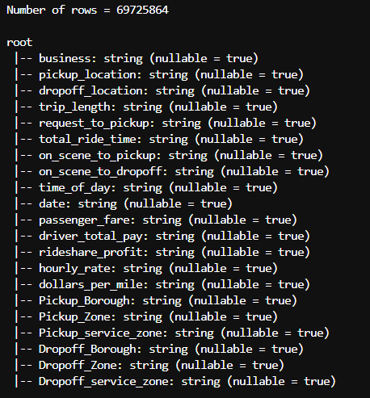

### Task 1: Merging Datasets
1. Load rideshare_data.csv and taxi_zone_lookup.csv.
2. Apply the 'join' function based on fields pickup_location and dropoff_location of rideshare_data table and the LocationID field of taxi_zone_lookup table, and rename those columns as Pickup_Borough, Pickup_Zone, Pickup_service_zone , Dropoff_Borough, Dropoff_Zone, Dropoff_service_zone. The join needs to be done in two steps. once using pickup_location and then output result is joined using dropoff_location. you will have a new dataframe (as shown below) with six new columns added to the original dataset.

- business: string (nullable = true)
- pickup_location: string (nullable = true)
- dropoff_location: string (nullable = true)
- trip_length: string (nullable = true)
- request_to_pickup: string (nullable = true)
- total_ride_time: string (nullable = true)
- on_scene_to_pickup: string (nullable = true)
- on_scene_to_dropoff: string (nullable = true)
- time_of_day: string (nullable = true)
- date: string (nullable = true)
- passenger_fare: string (nullable = true)
- driver_total_pay: string (nullable = true)
- rideshare_profit: string (nullable = true)
- hourly_rate: string (nullable = true)
- dollars_per_mile: string (nullable = true)
- Pickup_Borough: string (nullable = true)
- Pickup_Zone: string (nullable = true)
- Pickup_service_zone: string (nullable = true)
- Dropoff_Borough: string (nullable = true)
- Dropoff_Zone: string (nullable = true)
- Dropoff_service_zone: string (nullable = true)

3. The date field uses a UNIX timestamp, you need to convert the UNIX timestamp to the "yyyy-MM-dd" format. For example, '1684713600' to '2023-05-22'. UNIX timestamp represents the number of seconds elapsed since January 1, 1970, UTC. However, in this dataframe, the UNIX timestamp is converted from (yyyy-MM-dd) without the specific time of day (hh-mm-ss). For example, the '1684713600' is converted from '2023-05-22'.
4. After performing the above operations, print the number of rows (69725864) and schema of the new dataframe in the terminal. Verify that your schema matches the above resulting schemas. You need to provide the screenshots of your scheme and the number of rows in your report.

## Output
## Code explanation and API used:
- __spark.read.option("header", True).csv()__ is used to read a CSV file into a dataframe, and “header” = True states that the first row of the CSV file contains the header. Using this, 2 dataframes are created.
- The __.join()__ API is used to perform inner join on the 2 dataframes (rideshare data and taxi zone lookup) on the condition that the pickup location in the rideshare data is the same as the location ID in the taxi zone lookup.
- The __.withColumnRenamed()__ API is used to rename the columns after the performing the join operation.
- __.drop("LocationID")__ is used to remove the duplicate “Location ID” column from the joined dataframe.
- __.withColumn("date", from_unixtime(col("date"),"yyyy-MM-dd"))__ adds a new column "date" formatted as yyyy-MM-dd by converting Unix timestamp to a string.
- __.count()__ is used to get the number of rows in the combined dataframe.
- __.printSchema()__ is used to print the schema of the dataframe, including column names and data type.

## Output
- Final dataframe with “date” column converted from UNIX timestamp to yyyy-MM-dd format.

- Number of row and schema of the final dataframe.
