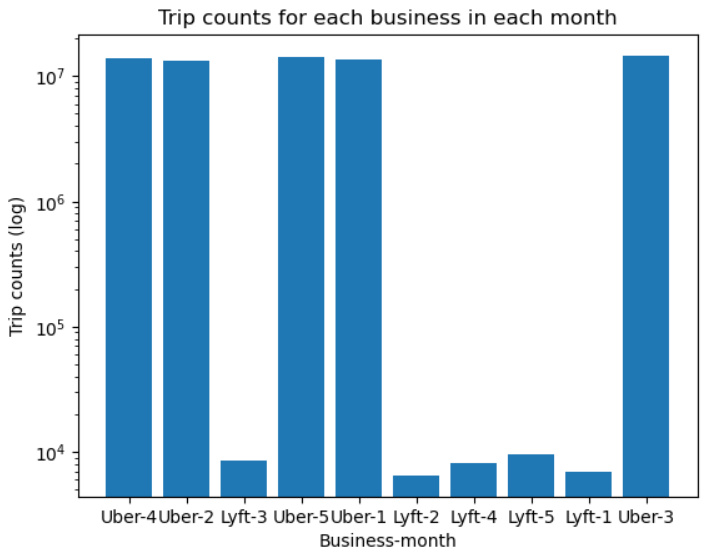
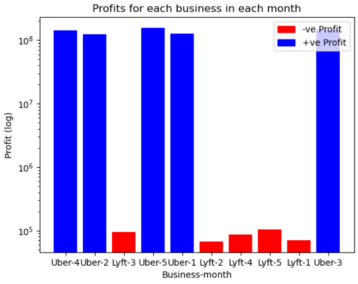
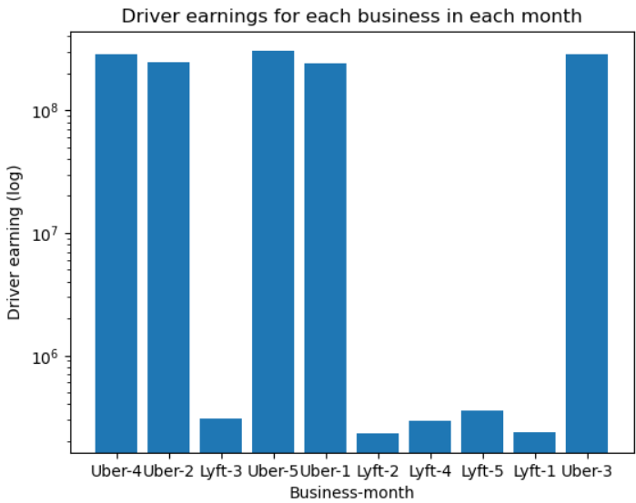

### Task 2: Aggregation of Data
1. Count the number of trips for each business in each month. Draw the histogram with 'business-month' on the x-axis and trip counts on the y-axis. For example, assume if Calculate the platform's profits (rideshare_profit field) for each business in each month. Draw the histogram with 'business-month' on the x-axis and the platform's profits on the y-axis. For example, assume if the platform's profits for Uber in January is 33333333, 'Uber-1' will be on the x-axis, indicating 33333333 above the bar of 'Uber-1'.
3. Calculate the driver's earnings (driver_total_pay field) for each business in each month. Draw the histogram with 'business-month' on the x-axis and the driver's earnings on the y-axis. For example, assume if the driver's earnings for Uber in January is 4444444, 'Uber-1' will be on the x-axis, indicating 4444444 above the bar of 'Uber-1'.

### Code explanation and API used
- The __.select()__ API is used to get specific columns from the dataframe (business, date, rideshare_profit, and driver_total_pay).
- __.cast(“int”)__ is used on 2 columns (rideshare_profit and driver_total_pay) to convert them into integer types.
- The month component is extracted from the “date” column by using __month()__ function, and a new column “business_month” is created by concatenating the “business” column with the “month” column using the expr function.
- __.groupBy("business_month").count()__ is used to group the dataframe by the “business_month” column and counts the number of occurrences for each group.
- __.groupBy("business_month").agg(sum("rideshare_profit").alias("profit"))__ is used to group the dataframe by the “business_month” column, gets the sum of “rideshare_profit” for each group, and puts them in a new column “profit”.
- __.groupBy("business_month").agg(sum("driver_total_pay").alias("driver_earning"))__ is used to group the dataframe by the “business_month” column, gets the sum of “driver_total_pay” for each group, and puts them in a new column “driver_earning”.
- __.coalesce(1).write.options(header=True).csv("s3a://" + s3_bucket)__. The 3 new dataframes created are stored as CSV files in the S3 bucket. coalesce(1) ensures that the dataframe is written to a single file.

### Outputs
- Number of trips for each business in each month
<!--  -->

- Profits for each business in each month
<!--  -->

- Driver’s earning for each business in each month
<!--  -->
