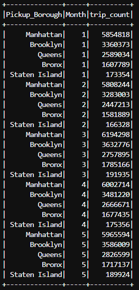
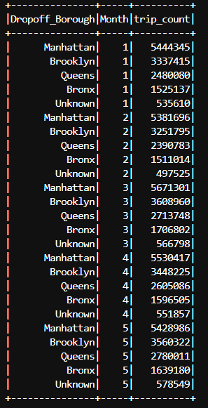
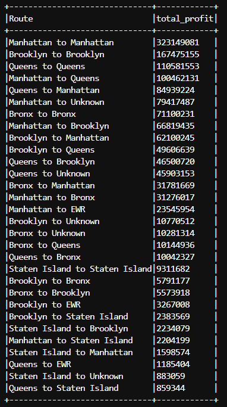

### Task 3 (25 points): Top-K Processing
1. (7 points) Identify the top 5 popular pickup boroughs each month. you need to provide a screenshot of your result in your report. The columns should include, Pickup_Borough, Month, and trip_count. you need to sort the output by trip_count by descending in each month. For example,

| Pickup_Borough | Month | trip_count |  
|----------------|-------|------------|  
| Manhattan      | 1     | 5          |  
| Brooklyn       | 1     | 4          |  
| Queens         | 1     | 3          |  
| Bronx          | 1     | 2          |  
| Staten Island  | 1     | 1          |  
| ...            | ...   | ...        |

Note, that the above figures/values of the trip_count field do not represent the actual result.
2. (7 points) Identify the top 5 popular dropoff boroughs each month. you need to provide a screenshot of your result in your report. The columns should include, Dropoff_Borough, Month, and trip_count. you need to sort the output by trip count by descending in each month. For example,

| Dropoff_Borough | Month | trip_count |  
|-----------------|-------|------------|  
| Manhattan       | 2     | 5          |  
| Brooklyn        | 2     | 4          |  
| Queens          | 2     | 3          |  
| Bronx           | 2     | 2          |  
| Staten Island   | 2     | 1          |  
| ...             | ...   | ...        |

Note, that the above figures/values of the trip_count field do not represent the actual result.
3. (8 points) Identify the top 30 earnest routes. Use 'Pickup Borough' to 'Dropoff_Borough' as route, and use the sum of 'driver_total_pay' field as the profit, then you will have a route and total_profit relationship. The columns should include Route and total_profit. You need to provide a screenshot of your results in your report. Do not truncate the name of routes. For example,

| Route                | total_profit |     
|----------------------|--------------|   
| Queens to Queens     | 222          |   
| Brooklyn to Queens   | 111          |   
| ...                  | ...          |

### Code explanation and API used
- The relevant columns (pickup_borough, dropoff_borough, date, driver_total_pay) are extracted by using the __.select()__ API, and the “driver_total_pay” column is casted to integer type using __.cast("int")__.
- The month component is extracted from the “date” column by using __month()__ function.

# Q1 and Q2
- Grouping is performed on 2 columns (borough and month) by using __.groupBy()__, and the number of trips in each group is obtained by using the __.count()__ API.
- Then the obtained dataframe is partitioned by the “month” column using __.partitionBy()__ function, and is sorted by the “trip_count” in descending order by using __.orderBy(col("trip_count").desc())__.
- The __row_number()__ function is then used assign a sequential row number starting from 1 to the result of each window partition.
- __.filter(col(“row_number”) <= 5)__ is used to filter rows where the row number is less than or equal to 5, resulting in the top 5 for each month.

# Q3
- The “Routes” column is obtained by concatenating the “pickup_borough” and “dropoff_borough” columns using the __expr()__ function.
- The “Routes” are then grouped together using __.groupBy()__, and the __sum()__ of “driver_total_pay” for each route would be the total profit.
- The obtained dataframe is then sorted in descending order using __.orderBy()__ and __.desc()__, and the first 30 rows are printed.

### Outputs
- Top 5 popular pickup boroughs in each month
<!--  -->

- Top 5 popular dropoff boroughs each month
<!--  -->

- Top 30 earnest routes
<!--  -->
