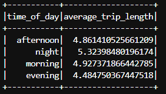

## Task 4 (15 points): Average of Data
1. (4 points) Calculate the average 'driver_total_pay' during different 'time_of_day' periods to find out which 'time_of_day' has the highest average 'driver_total_pay'. You need to provide a screenshot of this question in your report. The columns should include, time_of_day, average_drive_total_pay. You need to sort the output by average_drive_total_pay by descending. For example,

| time_of_day | average_drive_total_pay | 
|-------------|-------------------------|
| afternoon   |           25            |
| night       |           22            | 
| evening     |           20            | 
| morning     |           18            |

2. (4 points) Calculate the average 'trip_length' during different time_of_day periods to find out which 'time_of_day' has the highest average 'trip_length'. You need to provide a screenshot of this question in your report. The columns should include, time_of_day, average_trip_length. You need to sort the output by average_trip_length by descending. For example,

| time_of_day | average_trip_length | 
|-------------|--------------------|
| night       |          25        |
| morning     |          22        | 
| afternoon   |          20        | 
| evening     |          18        |

3. (5 points) Use the above two results to calculate the average earned per mile for each time_of_day period. You need to use 'join' function first and use average_drive_total_pay divided by average_trip_length to get the average_earning_per_mile. You need to provide a screenshot of this question in your report. The columns should include, time_of_day, and average_earning_per_mile. For example,

| time_of_day | average_earning_per_mile | 
|-------------|-------------------------|
| night       |           7             |
| morning     |           5             | 
| afternoon   |           6             | 
| evening     |           8            |

## Code explanation and API used
- Using __.select()__, the required columns (time_of_day, driver_total_pay, trip_length) are extracted.

#### Q1 and Q2
- __.groupBy("time_of_day").agg(avg("driver_total_pay").alias("average_drive_total_pay"))__ is used to group the dataframe by the “time_of_day” column, gets the average of “driver_total_pay” for each group, and puts them in a new column “average_ drive_total_pay”.
- __.groupBy("time_of_day").agg(avg("trip_length").alias("average_trip_length"))__ is used to group the dataframe by the “time_of_day” column, gets the average of “trip_length” for each group, and puts them in a new column “average_ trip_length”.

#### Q3
- The 2 dataframes obtained from Q1 and Q2 are joined together by the common column “time_of_day” using __.join()__.
- The “average_earning_per_mile” column is obtained by dividing the values from “average_drive_total_pay” column and “average_trip_length”, and the unwanted columns are dropped using __.drop()__.

## Outputs
- Average driver total pay during different time of day
<!--  -->

- Average trip length during different time of day
<!--  -->

- Average earned per mile for different time of day
<!--  -->
