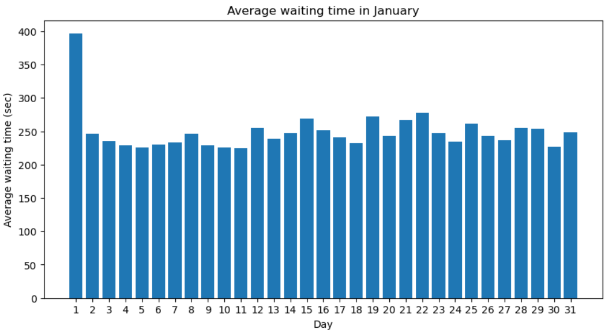

## Task 5: Finding anomalies
1. Extract the data in January and calculate the average waiting time (use the "request_to_pickup" field) over time. You need to sort the output by day. Draw the histogram with 'days' on the x-axis and ‘average waiting time’ on the y-axis. For example, assume that the ‘average waiting time on 'January 10' is '999', '10' will be on the x-axis, indicating the average waiting time value of 999 for day 10 in January.

## Code explanation and API used
- Using __.select()__, the required columns are selected (date and request_to_pickup)
- The month component is extracted from the date column using __month()__, and all the rows are filtered and only the data from the month of January __(month = 1)__ is selected. This is done by __.where(month(rideshare_df["date"]) == 1)__.
- After extracting only the January data, __dayofmonth()__ is used to get the day of the month from the “date” column.
- __.groupBy()__ function is used on the new dataframe to group all the days together, and get the average waiting time by using __.avg()__ on the “request_to_pickup” column.

## Outputs
- Histogram with 'days' on the x-axis and ‘average waiting time’ on the y-axis in the month of January
<!--  -->
