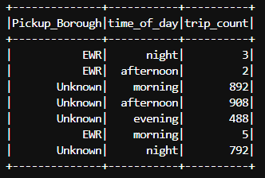
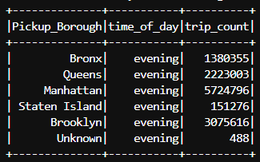
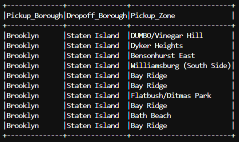

## Task 6: Filtering Data
1. Find trip counts greater than 0 and less than 1000 for different 'Pickup_Borough' at different 'time_of_day'. You need to provide a screenshot of this question in your report. The columns should include, Pickup_Borough, time_of_day, and trip_count. For example,

| Pickup_Borough | time_of_day | trip_count |
|----------------|-------------|------------|
| EWR            | afternoon   | 8          |
| EWR            | morning     | 8          |
| ...            | ...         | ...        |

2. Calculate the number of trips for each 'Pickup_Borough' in the evening time (i.e., time_of_day field). You need to provide a screenshot of this question in your report. The columns should include, Pickup_Borough, time_of_day, trip_count. For example,

| Pickup_Borough | time_of_day | trip_count |
|----------------|-------------|------------|
| EWR            | evening     | 23333      |
| Unknown        | evening     | 2222       |
| ...            | ...         | ...        |

3. Calculate the number of trips that started in Brooklyn (Pickup_Borough field) and ended in Staten Island (Dropoff_Borough field). Show 10 samples in the terminal. You need to provide a screenshot of this question (the 10 samples) and the number of trips in your report. The columns should include, Pickup_Borough, Dropoff_Borough, and Pickup_Zone. do not truncate the name of Pickup_Zone. For example,

| Pickup_Borough | Pickup_Borough   | Pickup_Zone |
|----------------|------------------|-------------|
| Brooklyn       | Staten Island    | Bay Ridge   |
| ...            | ...              | ...         |

## Code explanation and API used
- Using __.select()__, select the required columns.

#### Q1 and Q2
- Group the dataframe by 2 columns (pickup_borough and time_of_day) using __.groupBy()__, and then compute the count of each group using __.count()__.
- The obtained dataframe is then filtered using __.where((tripcount_df["trip_count"] > 0) & (tripcount_df["trip_count"] < 1000))__ to get trip count between 0 and 1000 (for Q1).
- __.where(tripcount_df["time_of_day"] == "evening")__ is used to filter the data to get the number of trips for each “pickup_borough” in the evening time (for Q2).

#### Q3
- __.where((pickup_dropoff_df["Pickup_Borough"] == "Brooklyn") & (pickup_dropoff_df["Dropoff_Borough"] == "Staten Island"))__ filters the dataframe such that the “pickup_borough” is Brooklyn and the “dropoff_borough” is Staten Island.
- __.count()__ is used to obtain the number of trips after filtering the data.

## Outputs
- Trip counts between 0 and 1000 for different pickup borough at different time of day
<!--  -->

- Trip counts for each pickup borough in the evening time
<!--  -->

- Trips that started in Brooklyn and ended in Staten Island and the number of trips
<!--  -->

Number of Trips = 69437