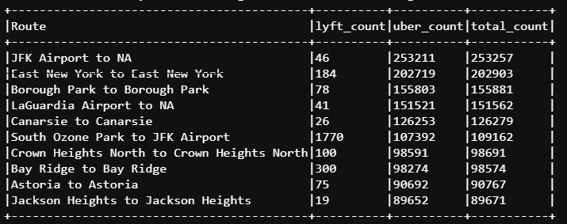

## Task 7: Routes Analysis
1. You need to analyse the 'Pickup_Zone' to 'Dropoff_Zone' routes to find the top 10 popular routes in terms of the trip count. Each total count of a route should include the trip counts for each unique route from Uber and Lyft (i.e., the sum of Uber and Lyft counts on the same route). Then you can get the top 10 in total count (e.g., sorting the result by total counts and displaying the top 10 routes or any other way). You may need to create a new column called Route which concats column Pickup_Zone with 'to' with column Dropoff_Zone. You need to give a screenshot of your result in your report, do not truncate the name of routes. The result table should include 'route', 'uber_count', 'lyft_count', and 'total_count'. For example,

    | Route                | uber_count | lyft_count | total_count |
    |----------------------|------------|------------|-------------|
    | JFK Airport to NA    | 253213     | 45         | 253258      |
    | Astoria to Jamaica   | 253212     | 12         | 253224      |
    | ......               | ......     | ......     | ......      |

## Code explanation and API used
- Using __.select()__, select the required columns.
- Create the “Route” column by concatenating “Pickup_zone” and “Dropoff_zone” using __expr()__ function.
- Using __.groupBy()__, group the dataframes by the “Route” column.
- To get routes with uber and lyft separately, __.pivot()__ can be used. This function allows us to transpose the column values into individual columns with distinct data.
- After performing pivot, __.count().na.fill(0)__ is used to get the count of each business for each route, and the null values are replaced with 0.
- To get the “total_count” column, the values from “lyft_count” and “uber_count” columns are added.

## Outputs
- Top 10 total trip counts for each unique route, with Uber and Lyft counts
<!--  -->
