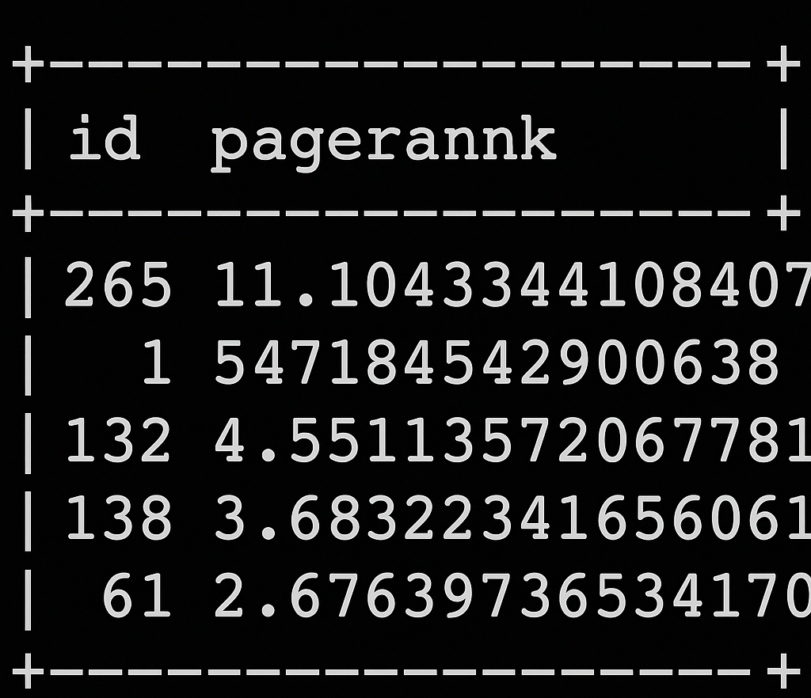

## Task 8: Graph Processing
Note, the tables provided in task 8 are from my results, you may or may not have the same results depending on how you process and show results.

1. Define the StructType of vertexSchema and edgeSchema. Use the taxi_zone_lookup.csv as vertex information and the 'pickup_location' field and the 'dropoff_location' field of rideshare_data.csv as 'src' and 'dst' information.
2. Construct edges dataframe, and vertices dataframe. Show 10 samples of the edges dataframe and vertices dataframe. You need to give a screenshot of your results in your report. Do not truncate the name of fields. The vertices table should include 'id', 'Borough', 'Zone', and 'service_zone'. The edges table should include 'src', 'dst'. For example,

    | id | Borough | Zone                      | service_zone |
    |----|---------|---------------------------|--------------|
    | 1  | EWR     | Newark Airport            | EWR          |
    | 2  | QUEENS  | Jamaica Bay               | Boro Zone    |
    | 3  | Bronx   | Allerton/Pelham Gardens   | Boro Zone    |
    | ...| ...     | ...                       | ...          |
    
    | src | dst |
    |-----|-----|
    | 151 | 244 |
    | 244 | 78  |
    | 151 | 138 |
    | ... | ... |
    
3. Create a graph using the vertices and edges. Print 10 samples of the graph DataFrame with columns ‘src’, ‘edge’, and ‘dst’. You need to give a screenshot of your results in your report. For example,

    | src                                                     | edge              | dst                                                    | 
    |---------------------------------------------------------|-------------------|--------------------------------------------------------|
    | [151, Manhattan, Manhattan Valley, Yellow Zone]         | [151, 244]        | [244, Manhattan, Washington Heights South, Boro Zone] |  
    | [244, Manhattan, Washington Heights South, Boro Zone]   | [244, 78]         | [78, Bronx, East Tremont, Boro Zone]                 |  
    | ...                                                     | ...               | ...                                                    |  
    
4. Count connected vertices with the same Borough and same service_zone. And, select 10 samples from your result. The table colums should include 'id'(src), 'id'(dst), 'Borough', and 'service_zone'. You need to give a screenshot of your 10 samples and the number of counts in your report. For example,

    | id  | id  | Borough | service_zone |
    |-----|-----|---------|--------------|
    | 182 | 242 | Bronx   | Boro Zone    |
    | 248 | 242 | Bronx   | Boro Zone    |
    | 242 | 20  | Bronx   | Boro Zone    |
    | 20  | 20  | Bronx   | Boro Zone    |
    | ... | ... | ...     | ...          |
    
5. Perform page ranking on the graph dataframe. You will set the 'resetProbability' to 0.17 and 'tol' to 0.01. And sort vertices by descending according to the value of PageRank. 'Show the 5 samples of your results. You need to give a screenshot of your results in your report. The table columns should include 'id', 'pagerank'. For example:

    | id  | pagerank            |
    |-----|---------------------|
    | 265 | 11.105433344108409  |
    | 1   | 5.4718454249206525  |
    | ... | ...                 |

## Code explanation and API used
- __.select("pickup_location", "dropoff_location").toDF("src", "dst")__ creates an edges dataframe, where each row represents a trip with pickup and dropoff locations. Similarly, the vertices dataframe is created.
- Using the __GraphFrame()__ API, a graph is created by passing the vertices and edges dataframes.
- __.triplets.show()__ is used to show the structure of the graph (triplets of vertices and edges).
- __.find("(a)-[e]->(b)").filter("a.Borough = b.Borough AND a.service_zone = b.service_zone")__ is used to find all the connected vertices (a and b) with the same borough and service_zone.
- Using the __pageRank(resetProbability=0.17, tol=0.01)__, the page rank can be calculated for vertices in the graph, and order the page ranks in descending order.

## Outputs
- Edges and vertices dataframes

<!--  -->
<!-- vertices -->

- Graph using vertices and edges
<!--  -->

- Connected vertices with the same borough and same service_zone
<!--  -->

Count = 46886992

- Pagerank on the graph dataframe
<!--  -->
